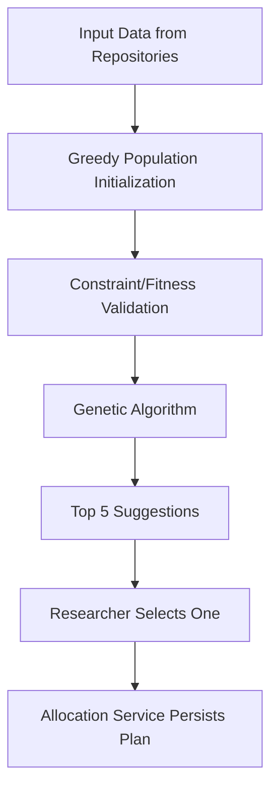
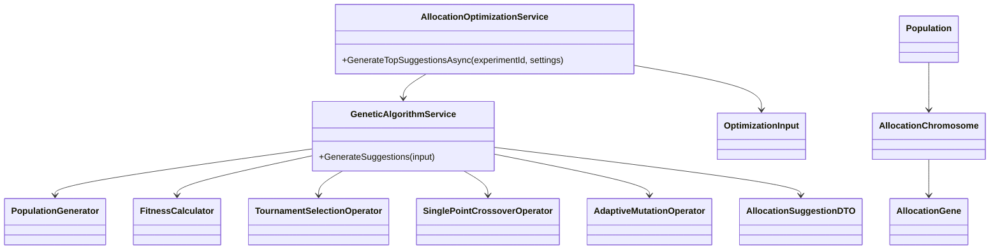
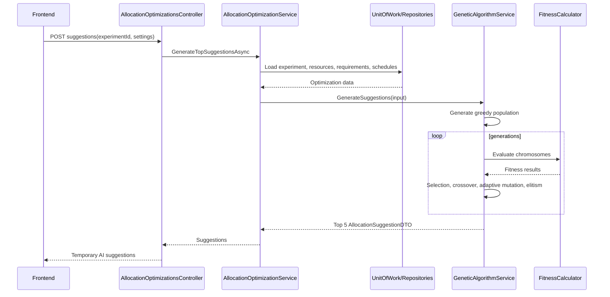

# AI Allocation Optimization Module

## Overall Architecture

The AI module lives in `FRPAMSystem.BusinessTier/AI` and follows the existing Clean Architecture boundary:

- API controllers call BusinessTier services.
- `AllocationOptimizationService` loads all required data through `IUnitOfWork`.
- `GeneticAlgorithmService` runs fully in memory.
- The genetic algorithm never queries or saves database records.
- Suggestions are temporary DTOs. A selected suggestion can later be converted by allocation services into `AllocationPlan`, details, and schedules.

Pipeline:



## Folder Structure

```text
AI/
  DTO/
    AllocationSuggestionDTO.cs
  Fitness/
    IFitnessCalculator.cs
    FitnessCalculator.cs
  Generator/
    IPopulationGenerator.cs
    PopulationGenerator.cs
  Models/
    AllocationChromosome.cs
    AllocationGene.cs
    EquipmentAssignmentGene.cs
    FitnessResult.cs
    OptimizationInput.cs
    OptimizationSettings.cs
    Population.cs
  Operators/
    Crossover/
    Mutation/
    Selection/
  Services/
    AllocationOptimizationService.cs
    GeneticAlgorithmService.cs
    IAllocationOptimizationService.cs
    IGeneticAlgorithmService.cs
```

## Class Diagram



## Class Responsibilities

- `OptimizationInput`: immutable-style data bundle containing loaded experiment, phases, requirements, resources, schedules, allocations, substitutions, and settings.
- `AllocationGene`: one phase allocation containing land, human resources, equipment assignments, and dates.
- `AllocationChromosome`: one full allocation plan candidate across all experiment phases.
- `PopulationGenerator`: greedy randomized initialization using available resources and requirements.
- `FitnessCalculator`: modular scoring for land, humans, equipment, schedule, and penalties.
- `TournamentSelectionOperator`: selects fitter parents while preserving diversity.
- `SinglePointCrossoverOperator`: combines parent phase allocations.
- `AdaptiveMutationOperator`: regenerates selected phase genes with a mutation rate that decreases over generations.
- `GeneticAlgorithmService`: orchestrates generations, elitism, evaluation, and Top 5 DTO mapping.
- `AllocationOptimizationService`: integration layer that preloads EF data through repositories.

## Execution Flow

1. Frontend calls `POST /api/AllocationOptimizations/experiments/{experimentId}/suggestions`.
2. `AllocationOptimizationService` loads all required entities using `IUnitOfWork`.
3. The service creates `OptimizationInput`.
4. `GeneticAlgorithmService` generates a greedy population.
5. Each chromosome is scored by `FitnessCalculator`.
6. For each generation, the service keeps elite chromosomes, selects parents, crosses them, mutates children, and evaluates again.
7. Best chromosomes are mapped to `AllocationSuggestionDTO`.
8. API returns at most five suggestions sorted by fitness descending.
9. No allocation plan is saved during this pipeline.

## Sequence Diagram



## Performance Optimization Suggestions

- Filter existing allocations by the experiment planning date range instead of loading all historical rows.
- Cache static resources such as skills, equipment substitutions, and equipment types.
- Parallelize chromosome fitness evaluation when the data volume grows.
- Store normalized resource availability windows in memory before running the algorithm.
- Tune `PopulationSize`, `GenerationCount`, and `EliteCount` by experiment size.
- Add telemetry for average fitness, best fitness, and conflict count per generation.
- Persist only the selected suggestion after researcher review.
