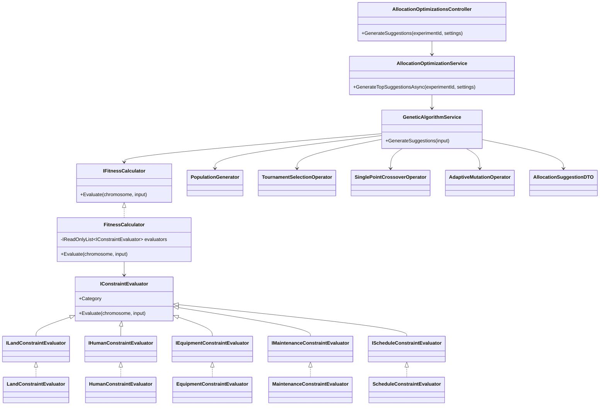

# AI Allocation Optimization Module

## Architecture Proposal

The public API, DTO contract entry point, database schema, controller, and orchestration flow remain compatible:

```text
Controller
  -> AllocationOptimizationService
  -> GeneticAlgorithmService
  -> PopulationGenerator / FitnessCalculator / Selection / Crossover / Mutation
  -> AllocationSuggestionDTO
```

The internal fitness model is refactored to Strategy Pattern evaluators. Each evaluator owns one optimization concern and returns a normalized `0..100` score, bonus, penalty, and detailed violations. `FitnessCalculator` is now an aggregator that applies configurable weights from `OptimizationSettings` and clamps the final fitness to `0..100`.

Hard constraints are represented by `ConstraintSeverity.Hard` and receive `HardConstraintPenalty`. Soft constraints are represented by `ConstraintSeverity.Soft` and receive `SoftConstraintPenalty`. Both penalty levels, category weights, and bonus/penalty multipliers are configurable through the existing optimization settings request body.

## Class Diagram



## Refactored Folder Structure

```text
AI/
  DTO/
    AllocationSuggestionDTO.cs
  Fitness/
    IFitnessCalculator.cs
    FitnessCalculator.cs
    Evaluators/
      ConstraintEvaluationResult.cs
      ConstraintSeverity.cs
      ConstraintViolation.cs
      FitnessEvaluationHelper.cs
      IConstraintEvaluator.cs
      ILandConstraintEvaluator.cs
      IHumanConstraintEvaluator.cs
      IEquipmentConstraintEvaluator.cs
      IMaintenanceConstraintEvaluator.cs
      IScheduleConstraintEvaluator.cs
      LandConstraintEvaluator.cs
      HumanConstraintEvaluator.cs
      EquipmentConstraintEvaluator.cs
      MaintenanceConstraintEvaluator.cs
      ScheduleConstraintEvaluator.cs
  Generator/
    IPopulationGenerator.cs
    PopulationGenerator.cs
  Models/
    AllocationChromosome.cs
    AllocationGene.cs
    EquipmentAssignmentGene.cs
    FitnessResult.cs
    OptimizationInput.cs
    OptimizationSettings.cs
    Population.cs
  Operators/
    Crossover/
    Mutation/
    Selection/
  Services/
    AllocationOptimizationService.cs
    GeneticAlgorithmService.cs
```

## New Interfaces

- `IConstraintEvaluator`: common Strategy Pattern contract for all constraint evaluators.
- `ILandConstraintEvaluator`: evaluates land area, soil type, status, utilization, and overlaps.
- `IHumanConstraintEvaluator`: evaluates role, skill, availability, workload balance, double booking, and max working hours.
- `IEquipmentConstraintEvaluator`: evaluates individual equipment, quantity-based equipment, substitutions, status, condition, and availability.
- `IMaintenanceConstraintEvaluator`: evaluates effective maintenance interval and remaining safe usage hours.
- `IScheduleConstraintEvaluator`: evaluates phase order, deadline, overlaps, idle gaps, and compactness.

## Fitness Design

Each evaluator returns:

- `Score`: normalized category score from `0..100`.
- `Penalty`: evaluator-specific penalty extension point.
- `Bonus`: evaluator-specific positive adjustment.
- `Violations`: detailed hard or soft constraint violations.
- `Advantages` and `Disadvantages`: human-readable explanation strings.

`FitnessCalculator` aggregates:

```text
weightedScore =
  LandScore * LandWeight +
  HumanScore * HumanWeight +
  EquipmentScore * EquipmentWeight +
  ScheduleScore * ScheduleWeight

FinalScore = clamp(weightedScore - penalty + bonus, 0, 100)
```

Equipment score blends assignment quality and maintenance suitability:

```text
EquipmentScore = EquipmentEvaluatorScore * 0.75 + MaintenanceEvaluatorScore * 0.25
```

## Constraint Coverage

Hard constraints:

- Insufficient land.
- Unavailable land.
- Human resource exceeds `MaxWorkingHoursPerDay`.
- Missing required role.
- Missing required skill.
- Equipment unavailable.
- Equipment in maintenance.
- Resource double booking.
- Phase order violation.

Soft constraints:

- Substitute equipment.
- Low remaining maintenance hours.
- Land larger than required.
- Quantity shortage for quantity-based equipment.
- Unnecessary idle gaps.
- Workload imbalance.

## Maintenance Formula

Maintenance suitability uses the requested formula:

```text
effective_interval =
  base_maintenance_interval_hours
  * condition_factor
  * maintenance_count_factor
```

Condition factors:

- Good: `1.0`
- Fair: `0.85`
- Poor: `0.60`
- Critical: `0.30`

Maintenance count factors:

- `0..2`: `1.0`
- `3..5`: `0.9`
- `6..10`: `0.75`
- `>10`: `0.60`

Fitness only evaluates suitability. It does not reset `usage_hours_since_last_maintenance`; that remains outside the fitness pipeline.

## Compatibility

Compatibility is preserved by keeping:

- `AllocationOptimizationsController` route and action unchanged.
- `IAllocationOptimizationService` unchanged.
- `IGeneticAlgorithmService` unchanged.
- `IFitnessCalculator.Evaluate(...)` unchanged.
- Database schema unchanged.
- Existing DTO fields unchanged.

The response DTO only receives additive fields:

- `BonusScore`
- `FitnessBreakdown`
- `ConstraintReport`

Existing clients can continue reading the original fields.

## GA Improvements

- Population initialization prefers unique chromosome fingerprints.
- Reproduction avoids duplicate children where the search space allows it.
- Elitism still preserves top candidates.
- Adaptive mutation now starts at `InitialMutationRate` and decays to `FinalMutationRate`.
- Defaults follow the requested example: `30%` early generations and `5%` late generations.
- Mutation, crossover, tournament selection, population size, generation count, and elite count remain configurable.

## Design Decisions

- Strategy Pattern isolates land, human, equipment, maintenance, and schedule scoring so each domain rule can be tested and explained independently.
- `FitnessCalculator` is kept as the public aggregation point to preserve the existing service architecture.
- Hard and soft constraints are modeled explicitly instead of using only a conflict count, making the result explainable to researchers.
- Scores are normalized at every evaluator boundary, then normalized again at final aggregation to guarantee `0..100`.
- Equipment substitution uses `EquipmentSubstitution.EfficiencyRate` when a substitution exists; the evaluator does not invent efficiency values.
- Quantity-based equipment shortages are penalized proportionally instead of invalidating the chromosome.
- Maintenance is separated from equipment assignment because suitability over time is a different optimization concern from type/status matching.
- DTO additions are non-breaking because no existing property is removed or renamed.
